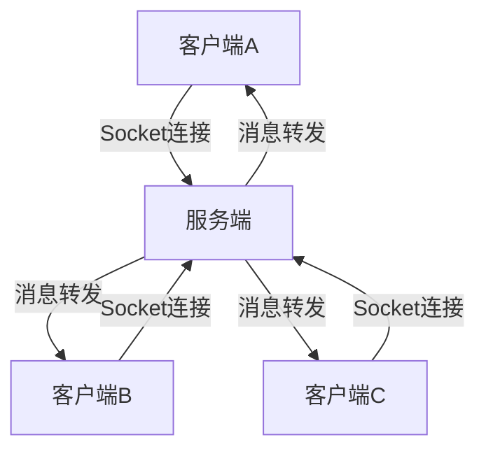

# 局域网沟通软件（Java Swing+Socket）

## 项目简介

本项目是一个基于Java Swing和Socket网络编程实现的局域网即时通讯软件，支持多用户实时群聊、在线人数显示等功能。项目采用客户端-服务端架构，适合学习和展示Java网络编程、GUI开发、多线程等核心技术。

## 功能特性

- 用户昵称登录
- 实时群聊（局域网内所有在线用户可互发消息）
- 在线人数与用户列表实时更新
- 简洁易用的图形化界面（Java Swing）
- 多线程处理，支持多客户端并发
- 服务端消息转发与在线用户管理

## 技术栈

- Java 8+
- Swing（GUI开发）
- Socket（网络通信）
- 多线程
- Maven（项目管理）

## 项目结构

```
untitled1/
  ├── chatAPP/         # 客户端模块
  │   ├── src/
  │   │   └── main/java/com/luo/
  │   │        ├── App.java           # 客户端主入口
  │   │        ├── Constant.java      # 常量定义
  │   │        ├── ui/                # UI界面相关
  │   │        │    ├── LoginUI.java  # 登录界面
  │   │        │    ├── ChatUI.java   # 聊天界面
  │   │        │    └── ClientReaderThread.java # 客户端消息接收线程
  │   │        ├── image/             # 界面图片资源
  │   │        └── readme.md          # 说明文档（可补充）
  │   └── resources/
  │        └── 《综合项目实战-局域网内的沟通软件》.md # 详细开发文档
  ├── chat-sever/      # 服务端模块
  │   ├── src/
  │   │   └── main/java/com/luo/
  │   │        ├── Sever.java         # 服务端主入口
  │   │        ├── SeverReaderThread.java # 服务端消息处理线程
  │   │        └── Constant.java      # 常量定义
  └── ...
```

## 系统架构



- 所有客户端通过Socket连接到服务端
- 服务端负责接收、转发消息，维护在线用户列表
- 客户端负责UI展示、消息发送与接收

## 运行方式

### 1. 启动服务端

进入 `chat-sever` 目录，编译并运行：

```bash
cd chat-sever
mvn clean package
java -cp target/classes com.luo.Sever
```

### 2. 启动客户端

进入 `chatAPP` 目录，编译并运行：

```bash
cd chatAPP
mvn clean package
java -cp target/classes com.luo.App
```

> 多开客户端即可模拟多用户聊天。

### 3. 登录与聊天

- 启动客户端后，输入昵称即可登录
- 进入群聊界面，输入消息点击发送即可与所有在线用户实时通讯

## 运行效果

- 登录界面  
  
- 群聊界面  
  

## 优化与扩展建议

如需将本项目作为求职作品，建议进一步完善：

- 增加注册/登录功能，支持用户密码
- 支持私聊、群聊房间、文件/图片传输
- 消息加密与安全认证
- 聊天记录本地/服务器端保存
- UI美化（可用JavaFX或美化Swing）
- 完善注释、单元测试与开发文档
- 增加一键运行脚本、演示视频或在线文档

## 致谢

本项目为Java网络编程与GUI综合实战项目，适合用于学习、展示和二次开发。

---

如需进一步个性化、增加创新点或补充技术博客、演示视频等内容，欢迎联系作者或自行扩展！
