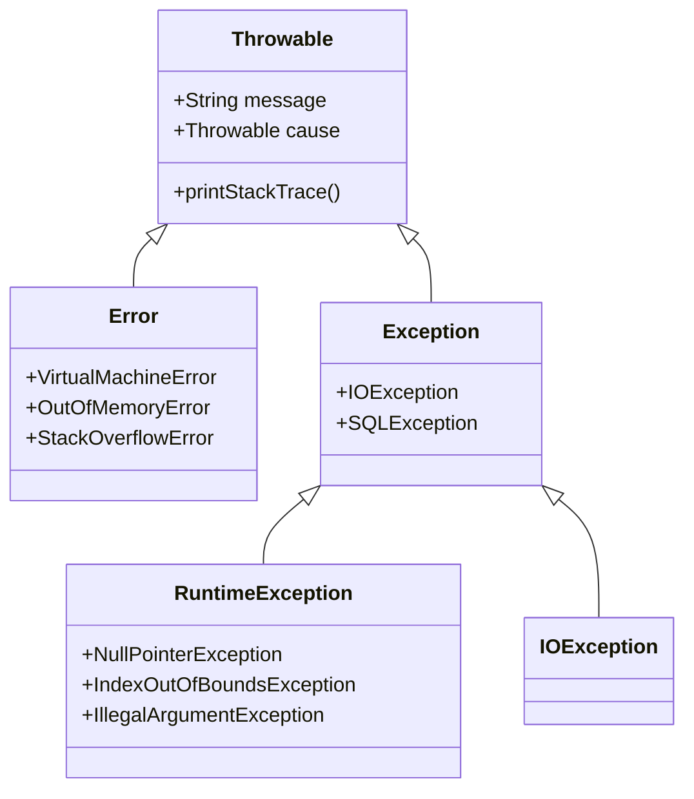

# Java 异常体系详解

## 一、异常概念与作用
**异常**指程序在执行过程中发生的非正常情况，会中断正常指令流。Java 异常机制的核心价值：
- 将错误处理代码与业务逻辑分离
- 沿调用栈向上传递错误信息
- 提供标准化的错误分类体系
- 强制处理可能的程序异常情况

## 二、Java 异常体系结构


### 1. Throwable 基类
所有异常/错误的超类，包含核心属性和方法：
- `message`：详细错误信息
- `cause`：根本原因（嵌套异常）
- `printStackTrace()`：打印异常栈轨迹

### 2. Error (严重错误)
**不可恢复**的系统级问题，程序通常无法处理：
- `OutOfMemoryError`：内存耗尽
- `StackOverflowError`：栈溢出
- `NoClassDefFoundError`：类加载失败

### 3. Exception (可处理异常)
程序可捕获并处理的异常，分为两类：

#### (1) Checked Exception (受检异常)
- 编译器强制处理的异常
- 继承自 `Exception` 但不属于 `RuntimeException`
- **典型代表**：
  - `IOException`：I/O 操作失败
  - `SQLException`：数据库访问错误
  - `ClassNotFoundException`：类未找到

#### (2) Unchecked Exception (非受检异常)
- 编译器不强制处理的异常
- 继承自 `RuntimeException`
- **典型代表**：
  - `NullPointerException`：空指针访问
  - `ArrayIndexOutOfBoundsException`：数组越界
  - `IllegalArgumentException`：非法参数
  - `NumberFormatException`：数字格式错误

## 三、异常处理机制

### 1. try-catch-finally 块
```java
try {
    // 可能抛出异常的代码
    FileInputStream fis = new FileInputStream("test.txt");
} catch (FileNotFoundException e) {
    // 处理特定异常
    System.err.println("文件未找到: " + e.getMessage());
} catch (IOException e) {
    // 处理更通用的异常
    System.err.println("IO错误: " + e.getCause());
} finally {
    // 无论是否异常都会执行
    System.out.println("资源清理操作");
}
```

### 2. throws 声明
```java
public void readFile() throws IOException {
    // 方法内部不处理异常，向调用者传递
    Files.readString(Path.of("data.txt"));
}
```

### 3. throw 主动抛出
```java
public void setAge(int age) {
    if (age < 0) {
        // 创建并抛出异常对象
        throw new IllegalArgumentException("年龄不能为负数");
    }
    this.age = age;
}
```

### 4. try-with-resources (Java 7+)
```java
// 自动关闭实现了 AutoCloseable 的资源
try (FileInputStream fis = new FileInputStream("file.txt");
     BufferedReader br = new BufferedReader(fis)) {
    return br.readLine();
}  // 自动调用 close() 方法
```

## 四、自定义异常
创建符合业务需求的异常类型：

```java
// 1. 继承 Exception (Checked)
public class BalanceInsufficientException extends Exception {
    public BalanceInsufficientException(String message) {
        super(message);
    }
}

// 2. 继承 RuntimeException (Unchecked)
public class InvalidOrderException extends RuntimeException {
    public InvalidOrderException(String message, Throwable cause) {
        super(message, cause);
    }
}

// 使用示例
public void withdraw(double amount) throws BalanceInsufficientException {
    if (amount > balance) {
        throw new BalanceInsufficientException("余额不足，当前余额: " + balance);
    }
    balance -= amount;
}
```

## 五、异常处理最佳实践
1. **精准捕获**：避免捕获通用异常（如 `catch(Exception e)`）
2. **资源释放**：使用 try-with-resources 确保资源关闭
3. **保留上下文**：传递异常时使用 `cause` 保留原始异常
   ```java
   throw new ServiceException("处理失败", e);
   ```
4. **日志记录**：在捕获点记录完整异常栈
   ```java
   catch (IOException e) {
       logger.error("文件操作失败", e);
   }
   ```
5. **避免空catch块**：至少记录或处理异常
6. **控制异常范围**：不要用异常处理常规控制流
7. **文档注释**：使用 @throws 说明方法可能抛出的异常

## 六、异常相关技术
| 技术/API | 用途 |
|---------|------|
| `e.getStackTrace()` | 获取栈轨迹数组 |
| `Thread.setDefaultUncaughtExceptionHandler()` | 全局异常处理 |
| `@SneakyThrows` (Lombok) | 自动抛出受检异常 |
| `Objects.requireNonNull()` | 空值检查并抛出NPE |
| `assert` 关键字 | 调试期断言检查 |

## 七、常见面试题
1. Error 和 Exception 的区别？
2. Checked 和 Unchecked 异常的区别？
3. finally 块在什么情况下不会执行？
4. throw 和 throws 的区别？
5. 异常处理中 return 和 finally 的执行顺序？
6. 如何自定义全局异常处理器？

> **经典问题答案示例**：  
> finally 块不执行的情况：  
> - JVM 退出 (System.exit())  
> - 守护线程被中断  
> - 系统崩溃或硬件故障

## 总结
Java 异常体系提供了完整的错误处理框架：
- **Error**：系统级严重问题，程序无法处理
- **Checked Exception**：必须处理的业务异常
- **Unchecked Exception**：运行时逻辑错误
- 遵循最佳实践可提高代码健壮性和可维护性

合理利用异常机制能使程序在错误发生时保持优雅降级，同时提供足够的诊断信息用于问题排查。