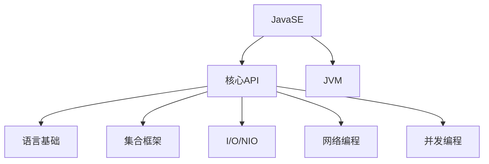
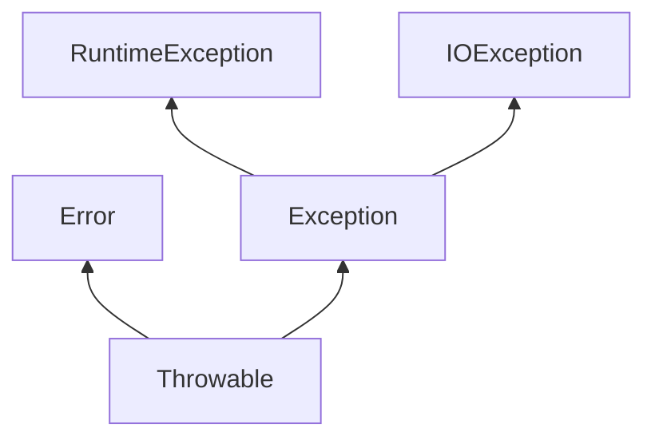

# JavaSE 详解

## 目录
1. [JavaSE概述](#javase概述)
2. [基础语法](#基础语法)
3. [面向对象编程](#面向对象编程)
4. [集合框架](#集合框架)
5. [异常处理](#异常处理)
6. [多线程](#多线程)
7. [I/O流](#io流)
8. [网络编程](#网络编程)
9. [反射机制](#反射机制)
10. [新特性](#新特性)

---

## JavaSE概述
Java Standard Edition (JavaSE) 是Java平台的核心，提供了基础API和JVM（Java虚拟机），用于开发和部署桌面、服务器及嵌入式应用。

**核心组件**:
- JVM (Java虚拟机)
- JRE (Java运行时环境)
- JDK (Java开发工具包)

**JavaSE架构**:


---

## 基础语法

### 数据类型
| 类型 | 关键字 | 大小 | 范围 |
|------|--------|------|------|
| 整型 | byte | 8位 | -128~127 |
|      | short | 16位 | -32768~32767 |
|      | int | 32位 | -2³¹~(2³¹-1) |
|      | long | 64位 | -2⁶³~(2⁶³-1) |
| 浮点 | float | 32位 | IEEE 754 |
|      | double | 64位 | IEEE 754 |
| 字符 | char | 16位 | Unicode字符 |
| 布尔 | boolean | 1位 | true/false |

### 控制结构
```java
// if-else
if (condition) {
    // code
} else if (condition2) {
    // code
} else {
    // code
}

// switch
switch (variable) {
    case value1:
        // code
        break;
    default:
        // code
}

// for循环
for (int i = 0; i < 10; i++) {
    // code
}

// while循环
while (condition) {
    // code
}

// do-while
do {
    // code
} while (condition);
```

---

## 面向对象编程

### 四大特性
1. **封装**：隐藏实现细节，提供公共访问方式
2. **继承**：子类继承父类属性和方法（单继承）
3. **多态**：同一操作作用于不同对象产生不同行为
4. **抽象**：提取共性形成抽象类/接口

### 类与对象
```java
public class Person {
    // 字段（属性）
    private String name;
    private int age;
    
    // 构造方法
    public Person(String name, int age) {
        this.name = name;
        this.age = age;
    }
    
    // 方法
    public void sayHello() {
        System.out.println("Hello, I'm " + name);
    }
    
    // Getter/Setter
    public String getName() { return name; }
    public void setName(String name) { this.name = name; }
}

// 使用类
Person p = new Person("Alice", 30);
p.sayHello();
```

### 接口与抽象类
| 特性 | 接口 | 抽象类 |
|------|------|--------|
| 实例化 | 不能 | 不能 |
| 方法实现 | Java8+支持默认方法 | 可以有具体方法 |
| 变量 | 默认public static final | 无限制 |
| 继承 | 多继承 | 单继承 |
| 构造器 | 无 | 有 |

```java
// 接口
interface Animal {
    void eat();
    default void breathe() {
        System.out.println("Breathing...");
    }
}

// 抽象类
abstract class Vehicle {
    abstract void run();
    void stop() {
        System.out.println("Vehicle stopped");
    }
}
```

---

## 集合框架
Java集合框架位于`java.util`包中，主要接口：
- `Collection`：所有集合的根接口
- `List`：有序集合（ArrayList, LinkedList）
- `Set`：不重复集合（HashSet, TreeSet）
- `Map`：键值对集合（HashMap, TreeMap）

### 常用集合类对比
| 集合类 | 有序 | 重复 | 线程安全 | 访问方式 |
|--------|------|------|----------|----------|
| ArrayList | 是 | 允许 | 否 | 索引访问 |
| LinkedList | 是 | 允许 | 否 | 链表访问 |
| HashSet | 否 | 不允许 | 否 | Hash访问 |
| TreeSet | 是(排序) | 不允许 | 否 | 树结构 |
| HashMap | 否 | 键唯一 | 否 | Key访问 |
| ConcurrentHashMap | 否 | 键唯一 | 是 | Key访问 |

### 示例代码
```java
// List示例
List<String> list = new ArrayList<>();
list.add("Apple");
list.add("Banana");
list.get(0); // "Apple"

// Map示例
Map<Integer, String> map = new HashMap<>();
map.put(1, "One");
map.put(2, "Two");
map.get(1); // "One"
```

---

## 异常处理
Java异常体系：


### 异常处理机制
```java
try {
    // 可能抛出异常的代码
    FileReader file = new FileReader("test.txt");
} catch (FileNotFoundException e) {
    // 处理特定异常
    System.out.println("File not found: " + e.getMessage());
} catch (Exception e) {
    // 通用异常处理
    e.printStackTrace();
} finally {
    // 无论是否异常都会执行
    System.out.println("Cleanup code");
}
```

### 自定义异常
```java
class MyException extends Exception {
    public MyException(String message) {
        super(message);
    }
}
```

---

## 多线程

### 线程创建方式
1. 继承Thread类
```java
class MyThread extends Thread {
    public void run() {
        System.out.println("Thread running");
    }
}
// 使用
new MyThread().start();
```

2. 实现Runnable接口（推荐）
```java
class MyRunnable implements Runnable {
    public void run() {
        System.out.println("Runnable running");
    }
}
// 使用
new Thread(new MyRunnable()).start();
```

### 线程同步
```java
// synchronized方法
public synchronized void syncMethod() {
    // 临界区代码
}

// synchronized块
public void someMethod() {
    synchronized(this) {
        // 临界区代码
    }
}

// ReentrantLock
Lock lock = new ReentrantLock();
lock.lock();
try {
    // 临界区代码
} finally {
    lock.unlock();
}
```

---

## I/O流
Java I/O分为：
- 字节流：处理二进制数据（InputStream/OutputStream）
- 字符流：处理文本数据（Reader/Writer）

### 常用I/O类
| 类型 | 字节流 | 字符流 |
|------|--------|--------|
| 文件 | FileInputStream<br>FileOutputStream | FileReader<br>FileWriter |
| 缓冲 | BufferedInputStream<br>BufferedOutputStream | BufferedReader<br>BufferedWriter |
| 数据转换 | DataInputStream<br>DataOutputStream |  |
| 对象序列化 | ObjectInputStream<br>ObjectOutputStream |  |

### 文件读写示例
```java
// 读取文本文件
try (BufferedReader br = new BufferedReader(new FileReader("input.txt"))) {
    String line;
    while ((line = br.readLine()) != null) {
        System.out.println(line);
    }
}

// 写入文本文件
try (BufferedWriter bw = new BufferedWriter(new FileWriter("output.txt"))) {
    bw.write("Hello, Java I/O!");
}
```

---

## 网络编程
Java网络编程核心类：
- `InetAddress`：IP地址封装
- `Socket`：客户端套接字
- `ServerSocket`：服务器套接字
- `DatagramSocket`：UDP通信

### TCP通信示例
**服务器端**:
```java
ServerSocket server = new ServerSocket(8080);
Socket socket = server.accept(); // 等待客户端连接
InputStream in = socket.getInputStream();
// 读取数据...
```

**客户端**:
```java
Socket socket = new Socket("localhost", 8080);
OutputStream out = socket.getOutputStream();
out.write("Hello Server".getBytes());
```

---

## 反射机制
反射允许在运行时检查/修改类和对象的行为

### 核心类
- `Class`：类的元数据
- `Field`：类的字段
- `Method`：类的方法
- `Constructor`：类的构造器

### 使用示例
```java
// 获取Class对象
Class<?> clazz = Class.forName("com.example.Person");

// 创建实例
Object obj = clazz.newInstance();

// 调用方法
Method method = clazz.getMethod("sayHello");
method.invoke(obj);

// 访问字段
Field field = clazz.getDeclaredField("name");
field.setAccessible(true); // 访问私有字段
field.set(obj, "Bob");
```

---

## 新特性

### Java 8+
| 版本 | 主要特性 |
|------|----------|
| Java 8 | Lambda表达式<br>Stream API<br>Optional类<br>新的日期时间API |
| Java 11 | HTTP Client API<br>局部变量类型推断(var) |
| Java 17 | Sealed类<br>Pattern Matching |

### Lambda表达式示例
```java
List<String> names = Arrays.asList("Alice", "Bob", "Charlie");
// 使用Lambda排序
names.sort((s1, s2) -> s1.compareTo(s2));
// 使用Stream过滤
List<String> result = names.stream()
                           .filter(name -> name.startsWith("A"))
                           .collect(Collectors.toList());
```

### Optional示例
```java
Optional<String> optional = Optional.ofNullable(getName());
String result = optional.orElse("default");
optional.ifPresent(System.out::println);
```

---

> **提示**：本文档仅覆盖JavaSE核心概念，每个主题都有更深入的细节值得探索。建议结合官方文档和实际编码实践深入学习。