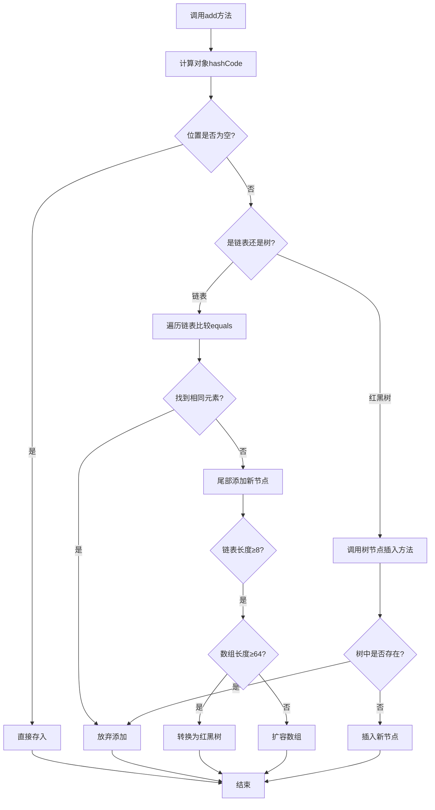

# HashSet底层原理详解

## 一、核心数据结构

### 1. 哈希表（Hash Table）
- **基本结构**：数组 + 链表/红黑树
- **数组**（table）：初始长度16，存储元素的桶(bucket)
- **链表**：解决哈希冲突（不同元素哈希值相同）
- **红黑树**：JDK8+优化，解决长链表查询效率问题

### 2. 加载因子（Load Factor）
- **默认值**：0.75
- **作用**：决定扩容时机（元素数量达到数组长度*加载因子时触发扩容）
- **计算公式**：扩容阈值 = 数组长度 × 加载因子

## 二、核心概念详解

### 1. 哈希值（Hash Value）
- **定义**：每个Java对象都有的int类型标识（通过hashCode()方法获取）
- **特性**：
    - 两个相等的对象（equals()返回true）必须有相同哈希值
    - 不相等的对象可能有相同哈希值（哈希碰撞）
- **计算规则**：
  ```java
  // JDK中的典型实现（Object类）
  public native int hashCode();
  
  // String类的hashCode实现（避免哈希碰撞）
  public int hashCode() {
      int h = hash;
      if (h == 0 && value.length > 0) {
          char val[] = value;
          for (int i = 0; i < value.length; i++) {
              h = 31 * h + val[i];
          }
          hash = h;
      }
      return h;
  }
  ```

### 2. 位置计算
- **核心算法**：
  ```java
  // 实际位置 = (数组长度 - 1) & hash
  int index = (n - 1) & hash;
  ```
- **位运算替代取模**：提高计算效率（要求数组长度为2的幂）

### 3. 红黑树（Red-Black Tree）
| 特性                | 说明                                 |
|---------------------|--------------------------------------|
| **自平衡二叉查找树** | 通过颜色约束保持相对平衡             |
| **时间复杂度**       | 查找/插入/删除：O(log n)             |
| **节点约束**         | 1. 节点是红或黑<br>2. 根节点是黑<br>3. 叶子节点(NIL)是黑<br>4. 红节点的子节点必须是黑<br>5. 从任一节点到其叶子的所有路径包含相同数目的黑节点 |

**触发条件**：
- 链表长度 > 8
- 数组长度 ≥ 64
- 否则优先扩容而非树化

**退化条件**：
- 树节点数 ≤ 6（UNTREEIFY_THRESHOLD）

## 三、操作流程解析

### 1. 添加元素流程


### 2. 扩容机制
- **触发条件**：元素数量 > 数组长度 × 0.75
- **扩容过程**：
    1. 创建新数组（原长度2倍）
    2. 重新计算所有元素位置（rehash）
    3. 迁移元素到新数组
- **优点**：分散元素，减少哈希碰撞
- **代价**：迁移过程消耗资源

## 四、版本演进对比

| 特性         | JDK7及之前               | JDK8+                     |
|--------------|--------------------------|---------------------------|
| **结构**      | 数组+链表               | 数组+链表+红黑树         |
| **冲突处理**  | 头插法（新元素插入链表头部） | 尾插法（新元素插入链表尾部） |
| **树化阈值**  | 无树化机制               | 链表≥8且数组≥64时树化     |
| **退化阈值**  | 无退化机制               | 树节点≤6时退化为链表      |
| **并发问题**  | 多线程扩容可能导致死循环   | 解决死循环问题            |

## 五、设计哲学与权衡

1. **空间换时间**：
    - 初始空间16（避免频繁扩容）
    - 加载因子0.75（平衡空间利用率和碰撞概率）

2. **渐进式优化**：
    - 小数据集：链表高效
    - 大数据集：自动转为红黑树

3. **动态适应**：
    - 扩容机制应对数据增长
    - 树化阈值避免极端性能退化

## 六、最佳实践

1. **重写hashCode()和equals()**：
   ```java
   public class CustomObject {
       private int id;
       private String name;
       
       @Override
       public int hashCode() {
           return Objects.hash(id, name); // 使用JDK工具类
       }
       
       @Override
       public boolean equals(Object o) {
           if (this == o) return true;
           if (o == null || getClass() != o.getClass()) return false;
           CustomObject that = (CustomObject) o;
           return id == that.id && Objects.equals(name, that.name);
       }
   }
   ```

2. **初始化优化**：
   ```java
   // 预估元素数量为100时
   Set<String> set = new HashSet<>(128); // 100/0.75≈133 → 取≥133的2的幂（128）
   ```

3. **避免可变对象**：
    - 对象存入后修改字段会导致hashCode变化
    - 可能导致元素"丢失"

> **关键总结**：HashSet通过巧妙的哈希算法+动态数据结构，在O(1)时间复杂度（平均情况）和O(log n)（最坏情况）之间取得平衡，成为Java集合框架中最高效的Set实现之一。